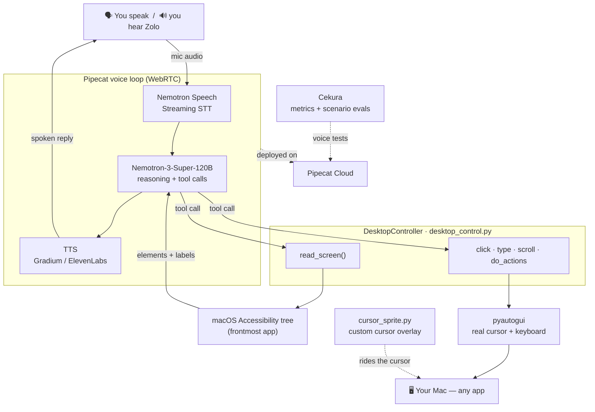

# Zolo 🖱️🗣️

A voice agent that **runs your Mac for you**. You talk; Zolo reads what's on screen and drives the
real cursor and keyboard to do it.

## 1. What is this?

We switch apps **~1,200 times a day**, and every real interruption costs **~23 minutes** to refocus
— about **4 hours a week** (≈9% of your work time) just reorienting. In all that toggling, things
slip through the cracks: the email you meant to answer, the reply you forgot. Context switching is
estimated to drain **~$450B a year** from the US economy — and on a $50/hr knowledge worker, that
lost ~4 hrs/week is roughly **$10K per person, per year.**

I was tired of constantly moving back and forth between a chatbot window and the docs I was
actually reading — so I built **Zolo, a voice-controlled assistant that lives on your OS.** You stay
right where you are and just talk; Zolo reads your screen and does it. No tab-switch, no copy-paste,
no losing your place.

You say *"search for sushi and open the first result"* and Zolo does it.

<sub>Sources: [Gloria Mark, UC Irvine — *The Cost of Interrupted Work*](https://www.ics.uci.edu/~gmark/chi08-mark.pdf) · [Harvard Business Review — app toggling (~1,200/day)](https://hbr.org/2022/08/how-much-time-and-energy-do-we-waste-toggling-between-applications) · [$450B/year estimate](https://www.waymakeros.com/learn/context-switching-costs-450b)</sub> Instead of guessing pixels
from a screenshot, it reads the **macOS Accessibility tree** of whatever app is in front and drives
the **real cursor + keyboard**. It narrates each step, asks before anything irreversible (Book / Pay /
Send), and shows a **custom cursor sprite** so you can watch it work. No vision model — just the
accessibility tree + `pyautogui`.

## Architecture



**The loop:** you talk → **Nemotron STT** transcribes → **Nemotron LLM** decides and calls a tool →
`read_screen` pulls real elements from the **macOS Accessibility tree** (or an action drives the
**real cursor** via `pyautogui`) → the LLM narrates the result → **TTS** speaks it back. Cekura runs
automated **voice tests** against the Pipecat Cloud deployment to catch and fix failures.

## 2. Demo (< 60s)

📹 **[Watch the demo](https://screen.studio/share/wv6eDhVG)**

## 3. Cekura + Nemotron + Pipecat

- **Pipecat** — the voice loop: STT → LLM → TTS, with Zolo's screen-control tools as function calls.
- **Nemotron (open weights)** — Nemotron Speech Streaming **STT** + **Nemotron-3-Super-120B** for all
  reasoning/tool use.
- **Cekura** — to test and improve it. We onboarded Zolo, wrote **3 custom metrics** (no jargon in
  speech, no "let me check" loops, confirm before clicking Book), and ran a **10-scenario voice
  suite**. Baseline was **20%**, and the metrics pinpointed the real bugs — an infinite "let me look
  at the screen" loop where the LLM never actually called its tool, and a booking made without
  confirmation. We then fixed each in the prompt.

**Specific tools we used, by company:**

- **NVIDIA Nemotron** — **Nemotron Speech Streaming STT** (WebSocket ASR) for the ears, and the
  **Nemotron-3-Super-120B** open-weights LLM (served via vLLM, OpenAI-compatible) for all reasoning
  and tool calls.
- **Pipecat** — the **Pipecat framework** (the STT → LLM → TTS pipeline + function-tool calling),
  **SmallWebRTC** transport for local dev and **Daily** transport for the cloud, **Silero VAD** +
  smart-turn detection, the **Krisp** noise filter, and **Pipecat Cloud** for deployment
  (`pipecat cloud deploy`).
- **Cekura** — the **Cekura MCP + skills** (in Claude Code) to create the agent, author **3 custom
  LLM-judge metrics** plus a **predefined metric suite**, **auto-generate a 10-scenario test set**,
  run **voice simulations**, and read per-scenario **results + failure analysis**.

## 4. What's new this hackathon

Started from the Pipecat flower-shop starter. **New this weekend:** the whole desktop-control agent —
`desktop_control.py` (accessibility-tree screen reading + real cursor control), `bot-zolo.py` (the
agent + tools + prompts), `cursor_sprite.py` (custom cursor), and the full Cekura eval setup
(3 custom metrics + 10 scenarios + baseline run + fixes).

## 5. Feedback

**Nemotron** — STT was fast and accurate; the LLM writes great natural voice copy. Weak spot:
**tool-calling** — it often *narrated* ("let me check the screen") instead of calling the tool, and
latency (p95 ~6–8s) was high for real-time voice.

**Cekura** — the custom metrics caught exactly the bugs we designed them to, with timestamps; great
self-improvement loop. Friction: run-trigger endpoints 401'd ("Check your CEKURA_API_KEY") even
though CRUD worked, the MCP session token expired mid-session, and voice-only agents can't run as
text.

## Run it

```bash
cd server && uv sync
uv run python cursor_sprite.py          # custom cursor overlay
ENV=local ZOLO_MODE=live uv run bot-zolo.py   # then open http://localhost:7860, Connect, and talk
```
